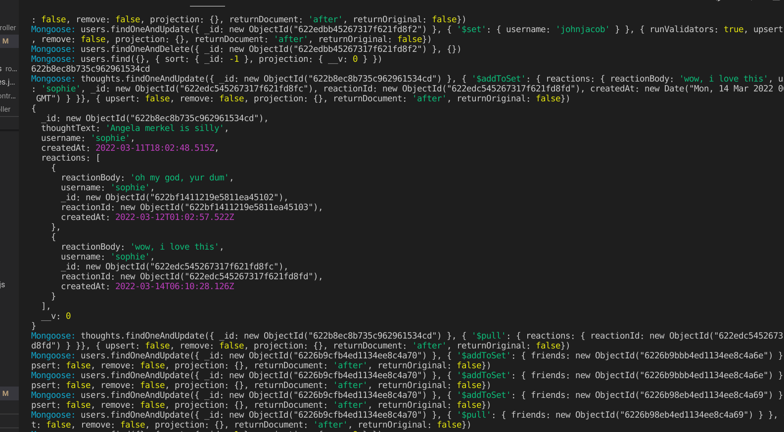
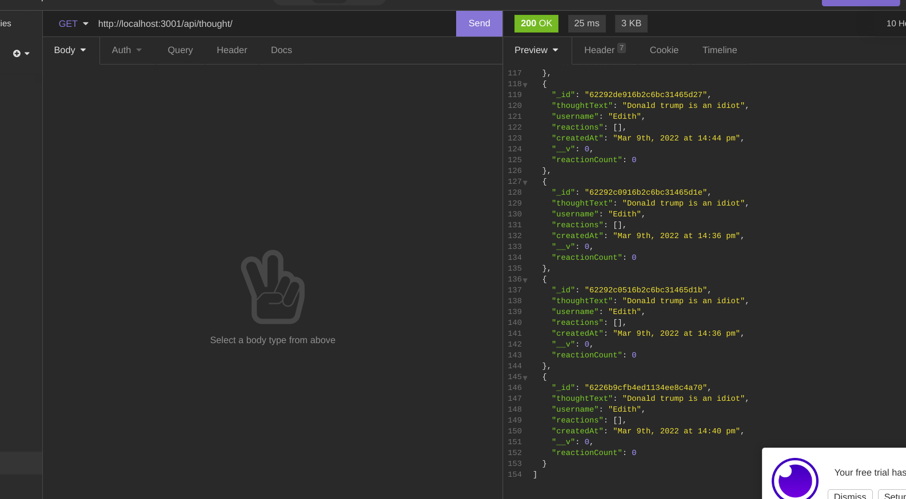

# head-space

A social media backend for philosophical thoughts and shitposts

## Table of Contents

- [Description](#description)
- [Installation](#installation)
- [Screenshot](#screenshot)
- [Video](#video)
- [Questions](#questions)

## Description

This is a social media backend made with mongodb and express. You can create both users and thoughts as well as reactions to thoughts and other users can be added as friends. It has basic crud activity and is kinda cool if I do say so myself

## Installation

MongoDb installed and running

1. Download or clone this repository.
2. On your local machine, open a terminal in the top level directory of the code.
3. On the command line, run npm install to install dependencies.
4. Run node server to start the server because I'm super lazy and didn't set up my package.json.

## Screenshot

Here is a screenshot of it running in the terminal

And here is a screenshot of running on insomnia.

## Video

[Here is the video of it working](./images/head-space.webm)

## Questions

If you have any questions please check out [my github](https://github.com/Naomilounsbury/head-space).
